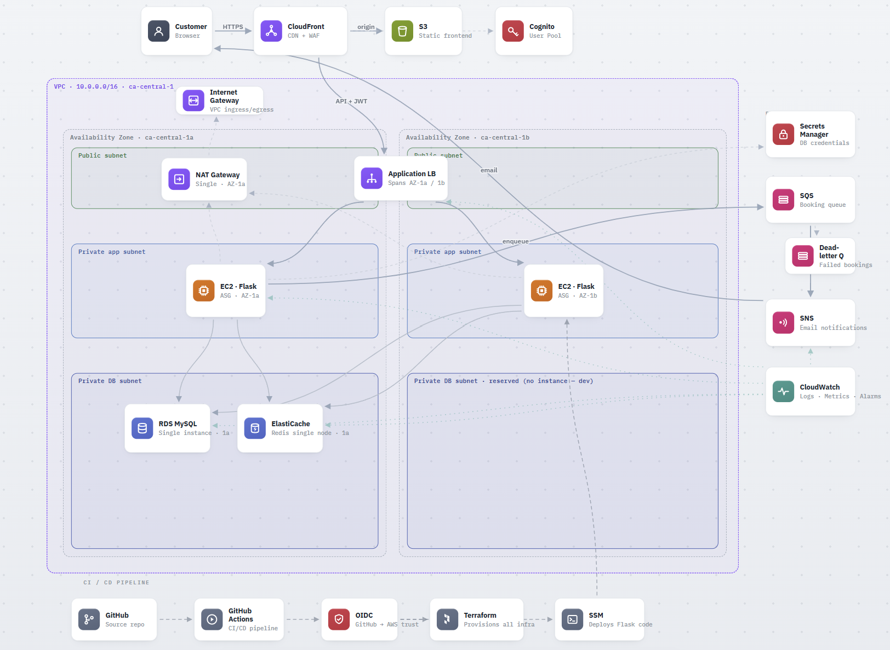

# AutoServe Pro



A production-grade vehicle service booking platform built entirely on AWS using Terraform, with a GitHub Actions CI/CD pipeline. Built as a learning project to understand how real cloud infrastructure is designed, secured, and deployed.

---

## What It Does

Customers book vehicle services (oil change, tire rotation, brakes, etc.) online. Admins see a dashboard with every booking across all customers and can update statuses in real time.

---

## Architecture

```
  User ──HTTPS──► CloudFront ──/api/*──► ALB ──► EC2 (Flask)
                      │                              │
                      │ default                      ├──► RDS MySQL
                      ▼                              ├──► ElastiCache Redis
                     S3                              └──► Secrets Manager
                  (index.html)
                                                     SQS → Worker → SNS
                                                     CloudWatch (logs + alarms)

  GitHub Push ──► GitHub Actions ──OIDC──► AWS
                                            ├──► Terraform (infra)
                                            ├──► SSM (app deploy)
                                            └──► S3 + CloudFront (frontend)
```

**Region:** `ca-central-1` (Toronto)

---

## Tech Stack

| Layer | Technology |
|-------|------------|
| Infrastructure | Terraform (modular) |
| Compute | EC2 + Auto Scaling Group + ALB |
| Database | RDS MySQL 8.0 |
| Cache | ElastiCache Redis |
| Auth | AWS Cognito (JWT, user groups) |
| CDN + WAF | CloudFront + AWS WAF |
| Frontend | S3 (static HTML/CSS/JS) |
| Messaging | SQS + SNS |
| Secrets | AWS Secrets Manager |
| Monitoring | CloudWatch |
| CI/CD | GitHub Actions |
| Backend | Python / Flask |

---

## Key Design Decisions

These are the deliberate choices made in this project and the reasoning behind each one.

### SSM instead of SSH
EC2 instances have no SSH keys and port 22 is not open. All access and deployments go through AWS Systems Manager (SSM). This eliminates key management, removes a common attack surface, and means there are zero credentials to rotate or leak.

### OIDC instead of stored AWS credentials in GitHub
GitHub Actions assumes an IAM role via OIDC — no AWS access keys are stored anywhere in GitHub secrets. The token is short-lived and scoped to only what the pipeline needs. If the token leaks, it expires automatically.

### CloudFront in front of ALB — ALB never exposed directly
CloudFront sits in front of everything. The ALB security group only allows traffic from CloudFront. This means WAF rules, HTTPS enforcement, and edge caching all happen before a single request reaches the backend.

### Secrets Manager instead of environment variables
The database password is never in code, never in a `.env` file, never in git history. Flask fetches it from Secrets Manager at runtime. If someone gets the EC2 instance, they still need IAM permission to read the secret.

### S3 native state locking instead of DynamoDB
Terraform 1.10+ supports state locking directly in S3 without a DynamoDB table. One less resource to manage, same protection against concurrent applies.

### Redis caching layer in front of RDS
Booking reads are served from Redis first. Only on a cache miss does it hit RDS. This reduces database load and speeds up the most common read operations. The cache source is shown in the UI (`⚡ Redis cache` vs `🗄️ Live RDS`).

### Plan and Apply as separate CI/CD jobs
The pipeline splits Terraform into two jobs — Plan saves the output to S3, Apply downloads and executes it. This means every infrastructure change is visible before it happens, and the Apply only runs after the Plan succeeds.

### Private subnets for EC2, RDS, and Redis
None of the application components have a public IP address. EC2 is in a private app subnet, RDS and Redis are in a private DB subnet. The only public-facing components are the ALB and CloudFront.

### Single NAT Gateway
A production setup would have one NAT Gateway per AZ for high availability. This dev environment uses one shared NAT Gateway to stay within AWS Free Tier. The second AZ DB subnet is reserved but labeled as such in the Terraform config.

### Cognito groups for role separation
Users belong to either `admins` or `customers` group in Cognito. The JWT token includes a `cognito:groups` claim. Every admin API route checks this claim server-side — the frontend role separation is just UI convenience, the real enforcement is in Flask.

### force_destroy on S3 bucket
S3 buckets with versioning enabled cannot be destroyed by Terraform unless empty. Setting `force_destroy = true` on the frontend bucket means the Destroy workflow can tear down everything cleanly without manual intervention.

---

## Infrastructure Modules

```
modules/
├── networking/    VPC, subnets, NAT Gateway, route tables
├── compute/       EC2 ASG, ALB, target group, security groups
├── database/      RDS MySQL, subnet group, Secrets Manager
├── cache/         ElastiCache Redis
├── auth/          Cognito user pool, groups, admin user
├── frontend/      S3 bucket, CloudFront, WAF, OAC
├── security/      WAF rules (common + SQLi + rate limiting)
├── messaging/     SQS + dead-letter queue, SNS topic
├── monitoring/    CloudWatch log groups, alarms
└── IAM/           OIDC provider, GitHub Actions role, EC2 profile
```

---

## Security Summary

- No SSH keys anywhere — SSM only
- No AWS credentials in GitHub — OIDC short-lived tokens
- No secrets in code or git — Secrets Manager at runtime
- No public EC2/RDS/Redis — private subnets only
- WAF on CloudFront — managed rules for common attacks, SQLi, rate limiting (100 req/5min per IP)
- HTTPS enforced — CloudFront redirects HTTP automatically
- JWT validation on every API request — admin group checked server-side

---

## CI/CD Pipeline

```
Push to dev/main
      │
      ├── Job 1: Terraform Plan  ──► saves plan to S3
      │
      ├── Job 2: Terraform Apply ──► downloads plan, applies infra
      │
      └── Job 3: Deploy App
                  ├── SSM send-command → git pull + restart Flask on EC2
                  ├── S3 sync         → upload index.html
                  └── CloudFront invalidation → clear CDN cache
```

---

## Getting Started

```bash
cp terraform.tfvars.example terraform.tfvars
# edit terraform.tfvars with your values
```

`terraform.tfvars` is gitignored — your real values never get pushed to GitHub.

---

## First Deploy — Admin Setup

After a fresh `terraform apply`, run this once to activate the admin account (Cognito creates it in "Force change password" state):

```bash
aws cognito-idp admin-set-user-password \
  --user-pool-id $(terraform output -raw cognito_user_pool_id) \
  --username barotdhruv099@gmail.com \
  --password <your-password> \
  --permanent \
  --region ca-central-1
```

## Destroy

Use the **Destroy** workflow in GitHub Actions. It empties the S3 frontend bucket first, then runs `terraform destroy` to remove all infrastructure cleanly.
